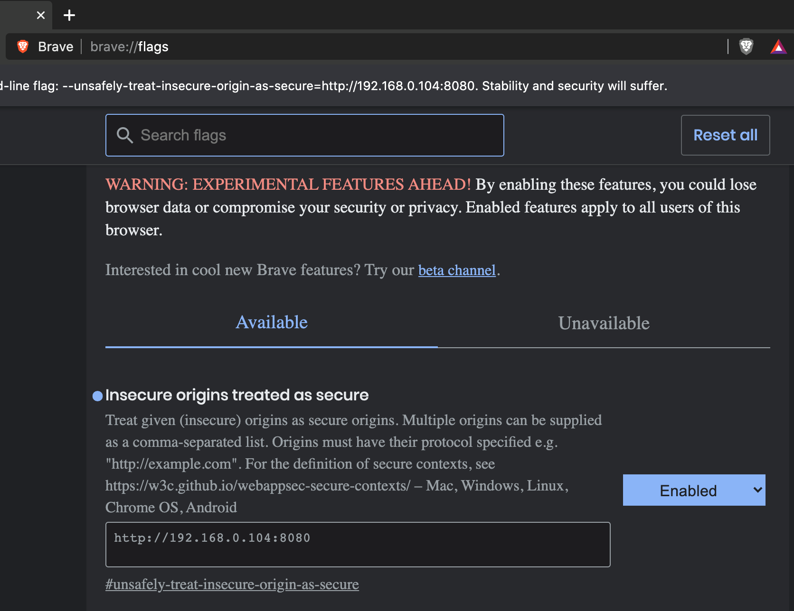

# WEB

* using aiortc
  * Can't control sample_rate?
    * SAMPLE RATE: 96000
    * CHUNK: 1920
  * WebRTC requires secure connection
  * Find out how to run a secure app?
    * cert.pem
    * key.pem
* Get stream from client and add to audio buffer in `WebAioRTCMicrophoneModule`
* Connect on same computer `127.0.1.1:8080`
* Connect on other local computer `192.168.0.104:8080`
  * Circumvent secure setting:
    * go to `brave://flags`
    * find `insecure origins treated as secure`
    * add `http://192.168.0.104:8080`

